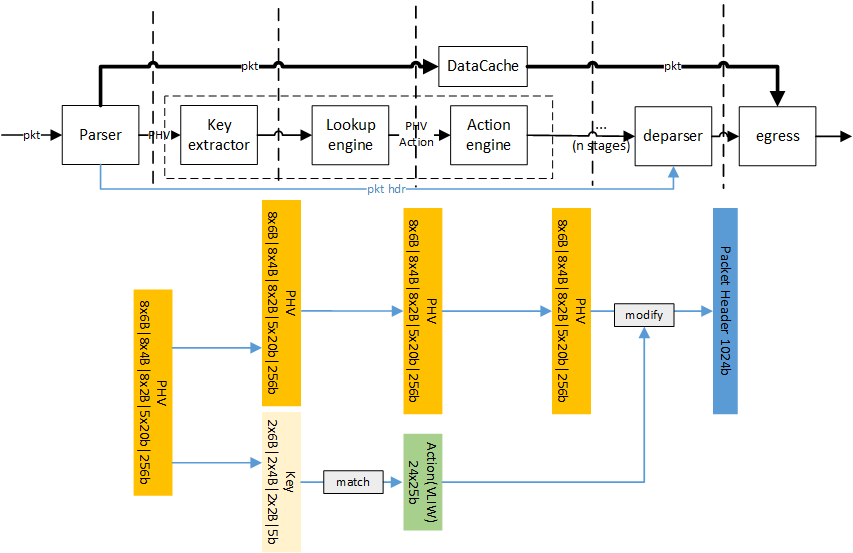
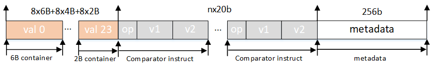
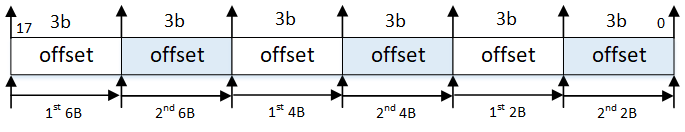
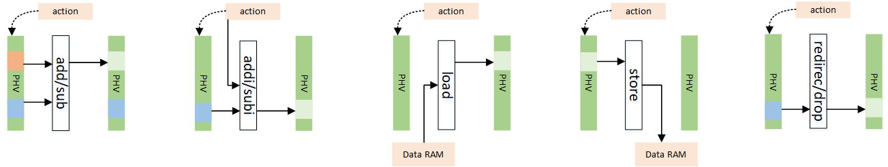
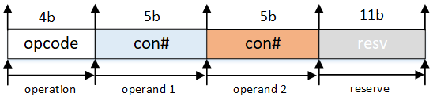
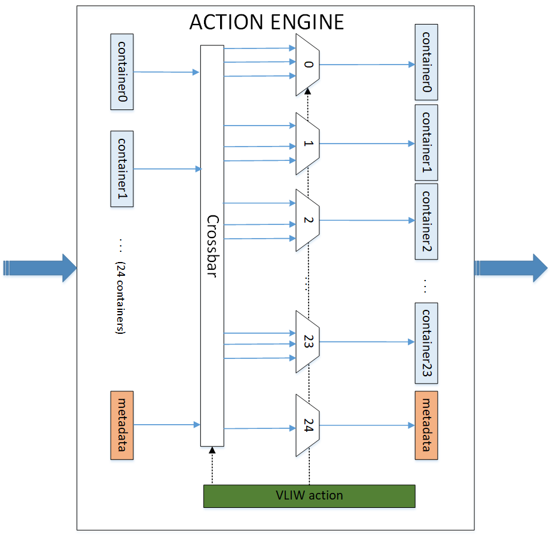

* ### Design notes

  

  ---

  #### Packet Header Vector

  basically, the packet header vector needs to contain **packet header**, **metadata** (ingress port, length, etc.) and also the **instruction**. The instruction defines **how to select the fields we extracted from the header and how to do with them** (put them into a MAT key? feed them into the comparator?)

  According to RMT paper, the packet header vector contains multiple values extracted from the packet header (src ip addr, etc.) and also the metadata (ingress port, length, etc.).


  The PHV is defined as below and is 1124b wide. (5-stage pipeline)

  


  ```|8x6B|8x4B|8x2B|nx20b|256b|``` (n is num of stage of pipeline)

  * `768b`:  the packet header value container. It contains 8x 6B, 4B and 2B to store values that will be used in the match-action stage.

  * `nx20b`: comparator sub-instruction in each stage (suppose ther are 5 stages at this point).

    > * highest `2b` is the opcode: `00` for `>`, `01` for `>=` and `10` for `==`
    > * the next `1b` is the immediate flag: `1` for immediate, `0` means the value needs to be retrieved from PHV.
    > * the next `8b` represents immediate or the way to retrieve the value from PHV (lowest 5b).
    > * the lowest 9b represents the 2nd operand (same format as the 1st op).


  * `256b`:  the metadata attached to the packet. The lower 128b, namely `[127:0]`, is copied from NetFPGA's `tuser` so that it follows the specification of NetFPGA. The 128th bit is termed as drop mark, where 1 means dropping.

    > * `[127:0]` is copied from NetFPGA's `tuser` data.
    > * `[128]` is the discard flag where 1 means drop packet.
    > * `[255:250]` represents the next match table the PHV is going to be matched with.
    > * `[140:129]` is the vlan id.
    > * `[249:141]` is reserved for other usage.

---

  #### Key Extractor

  Key Extractor is used to generate the key according to PHV. At first, the user should config the RAM in Key Extractor to extract the values that will be used in the following Lookup module. During the runtime, Key Extractor will extract the key out of PHV according to the instructions in the RAM. **Each key include 2x6B containers, 2x4B containers and 2x2B containers as well as 5b more which indicates the result of the conditions.**

  In multi-tenant scenarios, there is the possibility that the same fields (e.g., vlan_id) are located in different containers. In order to keep the key formats consistent to each other, a small lookup table is provided to allow extracting keys from different containers for different packets. In this process, `vlan_id` (from `metadata[140:129]`) is used as the `addr` for the lookup. an **18b wide entry** will be read out from the table. The format is as follows:

  

  meanwhile, in order to support `if-else` statement, Key Extractor module also set the value of the `conditional flag` according to the `nx20b` fields to determine if the match-action should be executed in the current stage.

  * Comparation:
  
    In stage `M`, the 2 operands and the operator in `M`-th will be extracted and fed in to the comparator. If the result is `1`, the flag to the lookup table would be set, meaning the key will be matched in the lookup engine. Otherwise, the lookup engine would be bypassed and the action field will be set to `0` (meaning do nothing in the stage).

---

  #### Lookup engine

  Lookup Engine takes the key generated from Parser, conducts a matching operation and outputs an VLIW-style `action` which determines the actions that need to execute in the Action Engine.


  * Format of the lookup table entry
  
    each entry consists of one 261b entry and one 261b mask to support ternary match. (256b for the key and 5b for conditional flags)
  
    For example: entry1: `10011001...1001` mask1:  `111111111...1000` would avoid the match of the lowest 3 bits.
  
  * Lookup elements
  
    Lookup Engine consists of 1 TCAM engine which is 271b wide.
  
  * Control plane
  
    both lookup table entry and action ram wil be configured using AXI-Lite. 

---

  #### Action Engine

  Action Engine takes the `action` output from Lookup Engine, and modifies PHV according to it. The actions that will be supported in the demo include `add`, `addi`, `sub`, `subi`, `load`, `store` `redirect port`, `discard`, `redirect table`. (still thinking about adding VxLAN and MPLS in the pipeline). Besides all these actions mentioned above, in each stage the action engine also needs to update the `next table id` in the metadata to support TTP in the RMT architecture.

  

  1. `add`: takes two operands from the PHV based on the indexes in the action field, add them, and write the result back to the location of 1st operand.
  2. `addi` takes one operand from PHV based on the index in the action field and one operand from the action field directly, add them, and write the result back to the location of operand. 
  3. `sub`: takes two operands from the PHV based on the indexes in the action field, substract the 2nd operand from the 1st, and write the result back to the location of 1st operand.
  4. `subi`: takes one operand from the PHV based on the index in the action field and one from the action field directly, substract the 2nd operand from the 1st, and write the result back to the location of 1st operand.
  5. `load`: read the value according to the address stored in the action field, write it into PHV according to the index in the action field.
  6. `store`: read the value from PHV according to the index in the action field, write it into the address stored in the action field.
  7. `port`: send the current packet from ports listed in the action field (including multicast).
  8. `discard`: drop the current packet.

  There are three types of actions: 2-operand action, 1-operand action and metadata action as is shown below.

  * Action format:
  
    For `add` (`0b'0001`) and `sub` (`0b'0010`) operations, the action format is:
  
    
  
    For `addi`(`0b'1001`), `subi`(`0b'1010`), `load`(`0b'1011`) and `store`(`0b'1000`), the action format is:
  
    
  
    For `port`(`4b'1100`) and `discard`(`4b'1101`), the action format is:
  
    

    The default action field is `0x3f`, which can be seen if no action is matched.


  In order to support VLIW (very long instruction word) in the action engine, there are 24 standard ALUs hard-wired with 24 containers in the PHV, and also 1 extra ALU to modify the metadata field in the PHV. A workflow of the action engine can be shown in the figure below:


  

    ***Action Details:***
    
    1. To simplify the design, `store`/`load` supports only 4B (32b) operations, while all other actions support 2B, 4B and 6B according to the data width of the 1st operand.

---

  #### Deparser

  Deparser is used to recombine the packet header using info from the orginal packet header and PHV. Generally, it reverses the process executed in Parser.

---

  #### Note 

    1. According to RMT, which match table the packet is going through is determined by the result (action) of the last match. In this way it forms a TTP (see TTP in OpenFlow).
    
      > The `control flow` is realized by giving each table an **index** (stage NO) and judging whether the PHV should be handled in the current stage by matching the **index** with a specific field in the `metadata`. Noted that the field in metadata that controls the control flow is modified by the action in each stage.
    
    2. Another question worth to ask is how to determine which fields in the container is going to be matched in the current stage.
    
      > One method would be using TCAM for the match table and masking the fields that we don't care.
    
    3. Different from the original RMT, we use a lookup table to support flexible key extraction from `PHV`. This is added in order to support multi-tenants scenarios, as different users may put the fields they are interested in into different PHV containers.
